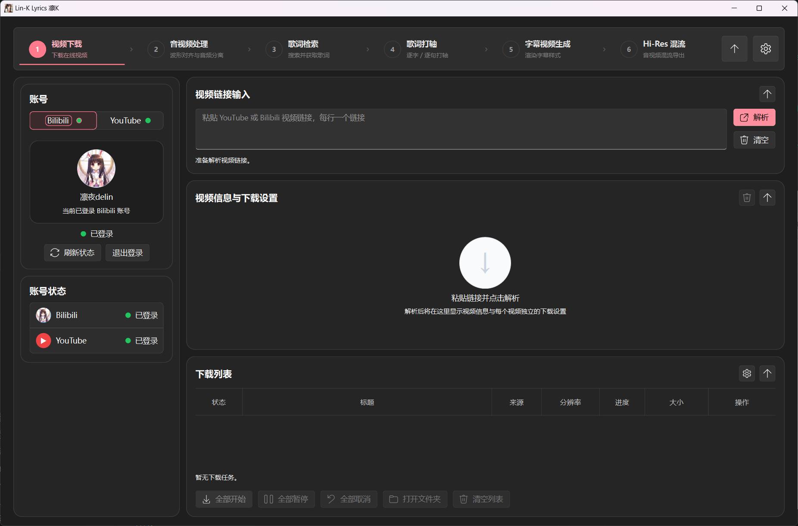
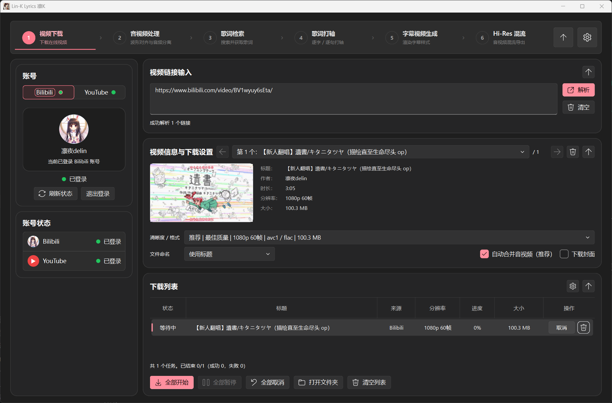
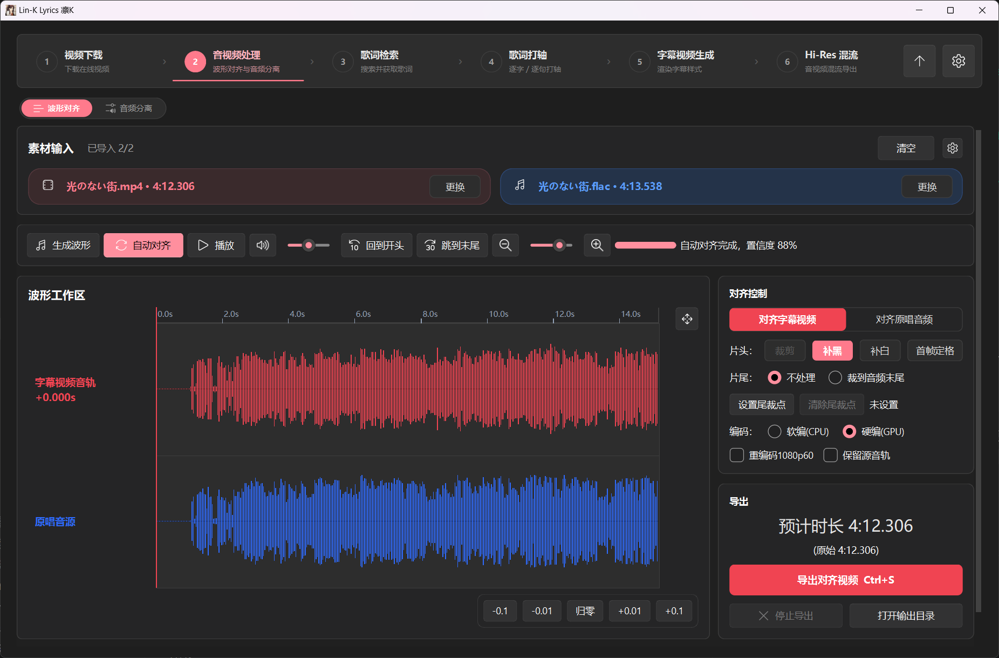
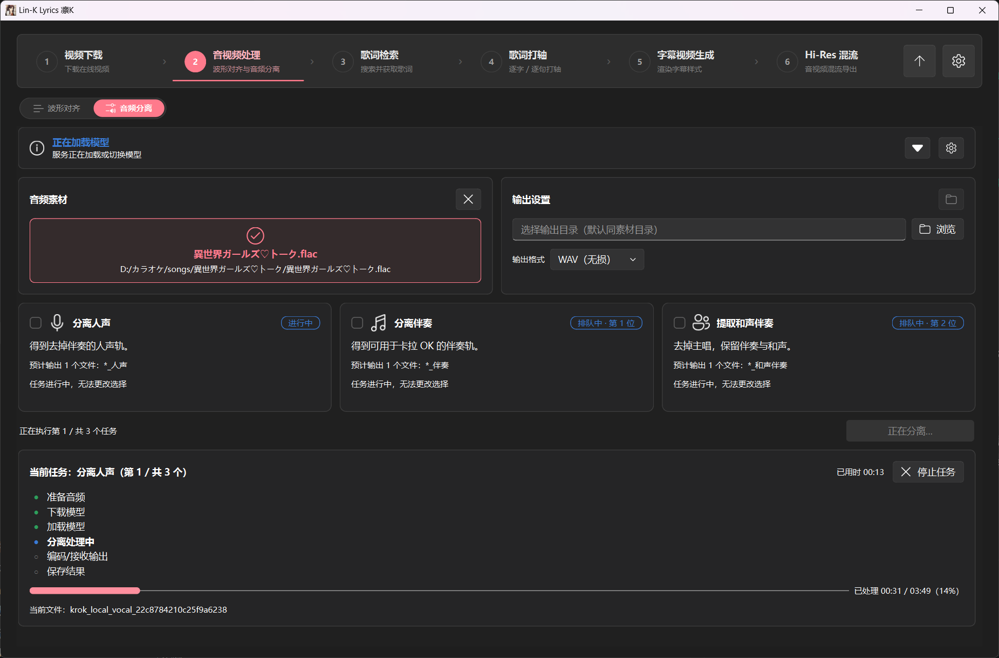
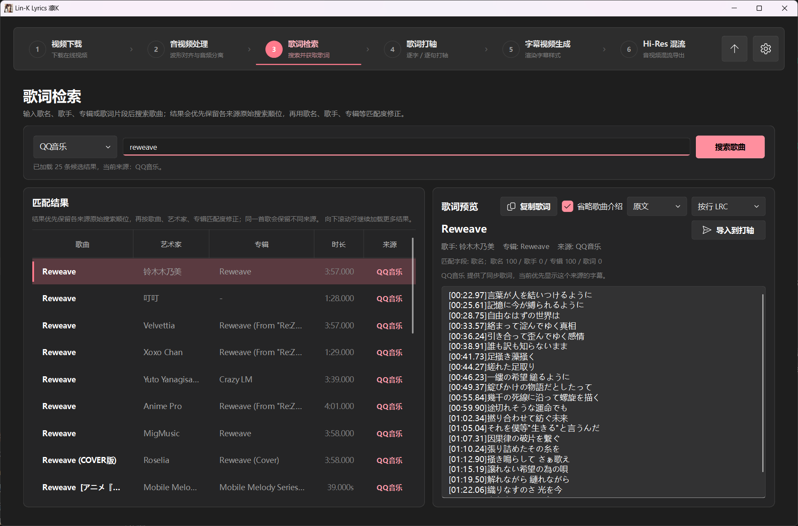
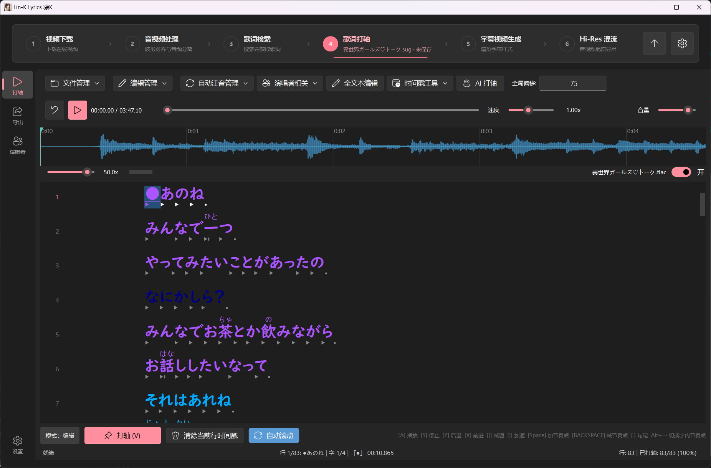
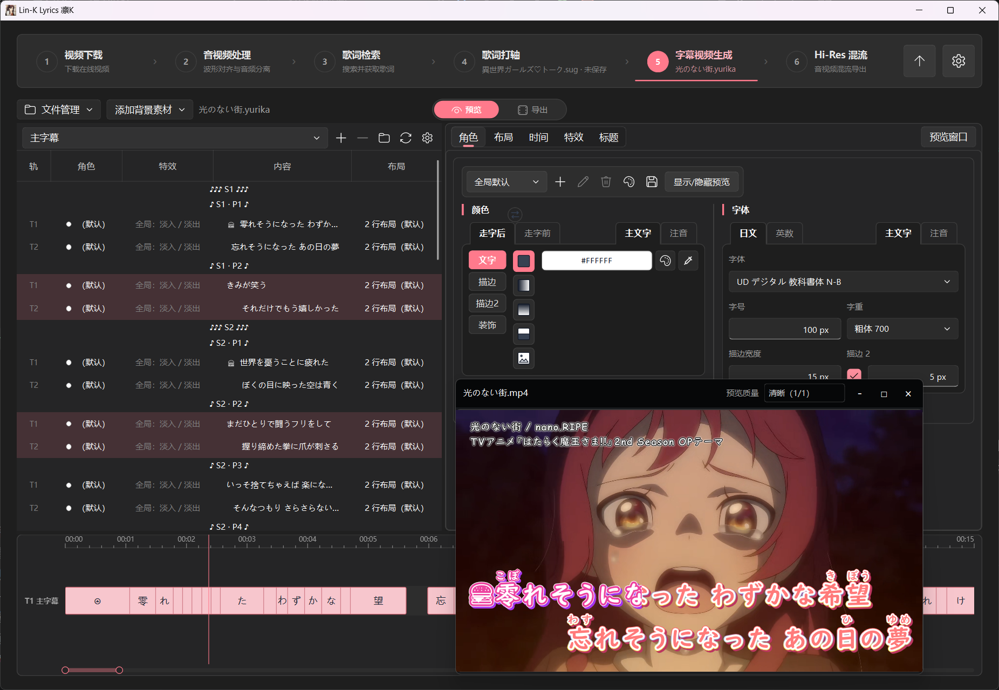
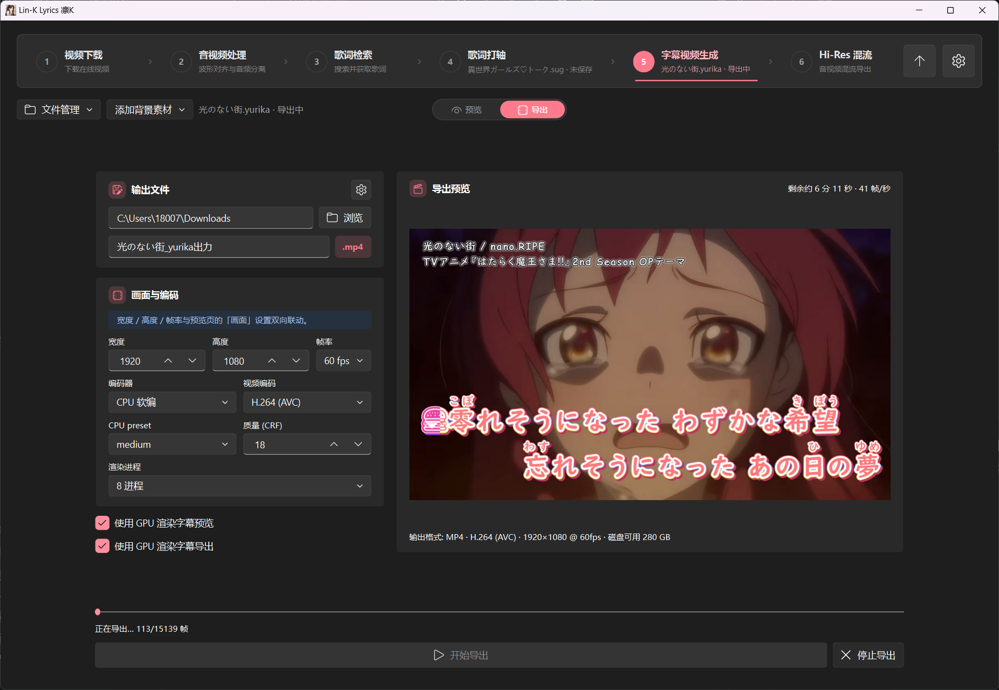
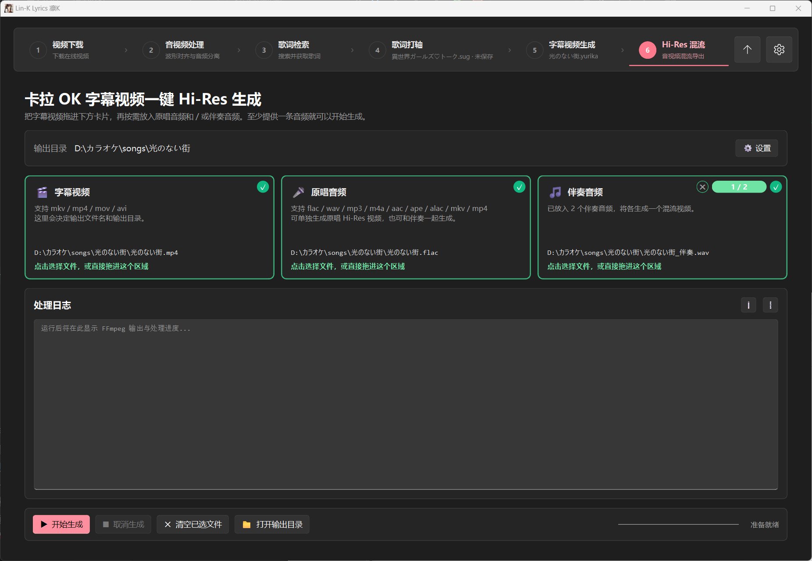
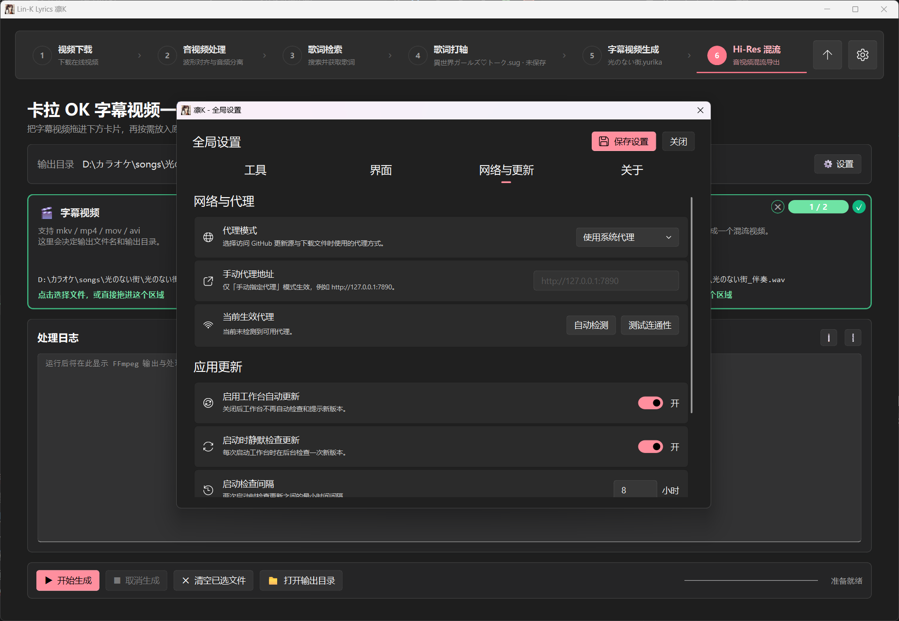

<!-- =======================================================
     Lin-K Lyrics · README
     双语 README · 紫色霓虹 / 二次元风
     ======================================================= -->

<div align="center">

<a href="#"></a>

<h1>
  <picture>
    <source media="(prefers-color-scheme: dark)"
            srcset="https://readme-typing-svg.demolab.com?font=Zen+Maru+Gothic&weight=700&size=44&duration=3000&pause=18000&color=C792EA&center=true&vCenter=true&width=560&height=64&lines=Lin-K+Lyrics" />
    
  </picture>
</h1>

<p>
  <b>凛K · 从素材下载到 Hi-Res 成品的一条龙</b><br/>
  <i>Lin-K · An all-in-one workflow from source downloads to Hi-Res deliverables.</i>
</p>

<p>
  <a href="https://github.com/karaoke-studio/karaoke-studio/releases">
    
  </a>
  <a href="https://github.com/karaoke-studio/karaoke-studio/stargazers">
    
  </a>
  <a href="https://github.com/karaoke-studio/karaoke-studio/issues">
    
  </a>
  
  
  
</p>

<p>
  <a href="#-简介--about">简介</a> ·
  <a href="#-截图--screenshots">截图</a> ·
  <a href="#-功能特性--features">功能</a> ·
  <a href="#-常用功能入口--where-to-find-settings">入口</a> ·
  <a href="#-安装与运行--installation">安装</a> ·
  <a href="#-faq">FAQ</a>
</p>

<sub>🇨🇳 中文 · 🇬🇧 English &nbsp;|&nbsp; <code> 卡拉OK · Karaoke · 打轴 · 字幕渲染 · Hi-Res</code></sub>

<br/><br/>

<a href="https://github.com/karaoke-studio/karaoke-studio">
  
</a>

<sub>觉得有帮助？<b>点亮一颗 ⭐ Star</b> 就是对作者最大的鼓励！<br/>
<i>Found it useful? A ⭐ Star is the warmest "thank you".</i></sub>

</div>

<br/>

当前版本：`4.2.6.4`

<!-- ───────────────────────────── 简介 ───────────────────────────── -->

## 💜 简介 / About

> **Lin-K Lyrics**（凛K）把做一支卡拉 OK 投稿要用到的几乎所有工具收进了一个应用。界面是一条**六步工作流**：`视频下载 → 音视频处理 → 歌词检索 → 歌词打轴 → 字幕视频生成 → Hi-Res 混流`。每一步的产物可以**一键交接**给下一步 —— 对齐好的视频直接变成字幕渲染的背景素材，分离出的伴奏直接落进混流页的伴奏卡，不用在文件管理器里来回倒腾。
>
> **Lin-K Lyrics** collapses nearly every tool needed to produce a karaoke video into one app, laid out as a **six-step workflow**: `video download → audio/video processing → lyrics lookup → lyrics timing → subtitle video rendering → Hi-Res muxing`. Each step can **hand its output to the next with one click**: an aligned video can become the subtitle renderer's background, while a separated instrumental can go straight into an instrumental card on the muxing page—no shuttling files back and forth through Explorer.

<table>
<tr>
<td width="50%" valign="top">

**🎯 适合谁 / Who it's for**

- 做卡拉OK字幕 / 翻唱字幕 / Vocaloid 字幕投稿的 UP 主 / Creators publishing karaoke, cover-song, or Vocaloid subtitle videos
- 需要 on vocal + off vocal + 和声伴奏三版本成品的人 / Anyone who needs on-vocal, off-vocal, and backing-vocal versions
- 想快速量产高质量卡拉OK视频的用户 / Users who want to produce high-quality karaoke videos efficiently

</td>
<td width="50%" valign="top">

**🚫 不是什么 / What it isn't**

- 不是全自动卡拉OK字幕生成器 / Not a fully automatic karaoke subtitle generator
- 不是视频剪辑软件 / Not a video editor
- 不是 DAW / Not a digital audio workstation

</td>
</tr>
</table>

> 🔗 第 4 步「歌词打轴」由姊妹项目 **[StrangeUtaGame](https://github.com/karaoke-studio/StrangeUtaGame)** 以 git 子模块的形式内嵌提供，详见下文[「与 StrangeUtaGame 的关系」](#-与-strangeutagame-的关系--relationship-to-sug)。
>
> Step 4, **Lyrics Timing**, is provided by the sister project **[StrangeUtaGame](https://github.com/karaoke-studio/StrangeUtaGame)**, embedded as a git submodule. See [Relationship to StrangeUtaGame](#-与-strangeutagame-的关系--relationship-to-sug) below.

<!-- ───────────────────────────── 截图 ───────────────────────────── -->

## 🎬 截图 / Screenshots

<div align="center">

<table>
<tr>
<td align="center" width="50%">
  <a href="assets/shot-workflow.png"></a><br/>
  <sub><b>主界面 · Six-step workflow</b><br/>顶部工作流条串起从下载到成品的完整链路</sub>
</td>
<td align="center" width="50%">
  <a href="assets/shot-download.png"></a><br/>
  <sub><b>视频下载 · YouTube / Bilibili</b><br/>格式表逐条列出分辨率、编码与体积，可批量解析</sub>
</td>
</tr>
<tr>
<td align="center" width="50%">
  <a href="assets/shot-align.png"></a><br/>
  <sub><b>波形对齐 · Waveform alignment</b><br/>互相关自动求偏移，前导补黑 / 补白 / 冻结首帧</sub>
</td>
<td align="center" width="50%">
  <a href="assets/shot-separation.png"></a><br/>
  <sub><b>音频分离 · Vocal separation</b><br/>人声 / 伴奏 / 和声伴奏三种任务，分阶段进度可见</sub>
</td>
</tr>
<tr>
<td align="center" width="50%">
  <a href="assets/shot-lyrics.png"></a><br/>
  <sub><b>歌词检索 · Multi-source lookup</b><br/>QQ音乐 / 酷狗 / 网易云 / LRCLIB 聚合排序</sub>
</td>
<td align="center" width="50%">
  <a href="assets/shot-timing.png"></a><br/>
  <sub><b>歌词打轴 · Embedded StrangeUtaGame</b><br/>低延迟回放 + 逐字节奏点 + 注音 + 多演唱者分色</sub>
</td>
</tr>
<tr>
<td align="center" width="50%">
  <a href="assets/shot-subtitle.png"></a><br/>
  <sub><b>字幕视频生成 · 预览</b><br/>实时走字预览，右侧按角色配色逐字符指派</sub>
</td>
<td align="center" width="50%">
  <a href="assets/shot-export.png"></a><br/>
  <sub><b>字幕视频生成 · 导出</b><br/>NVENC / QSV / AMF 硬编、H.264 与 H.265、多进程渲染</sub>
</td>
</tr>
<tr>
<td align="center" width="50%">
  <a href="assets/shot-hires.png"></a><br/>
  <sub><b>Hi-Res 混流 · Final mux</b><br/>多条伴奏各出一个成品，音频统一提到 Hi-Res FLAC</sub>
</td>
<td align="center" width="50%">
  <a href="assets/shot-settings.png"></a><br/>
  <sub><b>全局设置 · Settings</b><br/>工具 / 界面 / 网络与更新 / 关于 四个分页</sub>
</td>
</tr>
</table>

<sub>📌 截图待补充，文件名与拍摄要求见 <a href="assets/SCREENSHOTS.md"><code>assets/SCREENSHOTS.md</code></a>。<br/>
<i>Screenshots pending — see <code>assets/SCREENSHOTS.md</code> for the shot list.</i></sub>

</div>

<!-- ───────────────────────────── 功能 ───────────────────────────── -->

## ✨ 功能特性 / Features

<table>
<tr>
  <td width="60" align="center">🧭</td>
  <td>
    <b>六步工作流 + 步骤间自动交接 / Six-step workflow with hand-offs</b><br/>
    <sub>顶部工作流条把六个模块串成一条线，可折叠为紧凑模式。关键在于<b>交接</b>：波形对齐导出完会问你要不要把成片直接当作「字幕渲染背景素材」或「Hi-Res 原唱音源」；音频分离跑完会问你要不要把伴奏 / 和声伴奏直接送进第 6 步的伴奏卡。<br/>
    A collapsible stepper links all six modules, and each step offers to hand its result to the next — aligned video becomes the subtitle background or the Hi-Res on-vocal source, separated stems drop straight into the mux page.</sub>
  </td>
</tr>
<tr>
  <td align="center">⬇️</td>
  <td>
    <b>视频下载 / Video download</b><br/>
    <sub>基于 <b>yt-dlp</b> 拉取 <b>YouTube / Bilibili</b> 素材，支持多链接一次粘贴批量解析。下载走 <b>aria2c 多连接</b>加速，找不到或启动失败时自动回退 yt-dlp 自带的分块下载。支持<b>浏览器 Cookie 导入</b>（应对 YouTube 机器人校验）与 <b>B 站扫码登录</b>，并内置「一键更新 yt-dlp」按钮。<br/>
    Powered by <b>yt-dlp</b> with batch URL parsing, <b>aria2c multi-connection</b> downloads (auto-fallback when unavailable), browser cookie import for YouTube, Bilibili QR login, and a one-click yt-dlp self-update.</sub>
  </td>
</tr>
<tr>
  <td align="center">〰️</td>
  <td>
    <b>波形对齐 / Waveform alignment</b><br/>
    <sub>把下载来的视频和你手上的无损音源在时间轴上对齐：互相关自动搜索 <b>±6.0 秒</b>窗口求偏移，也可以手动微调。前导段可选<b>补黑 / 补白 / 冻结首帧</b>三种填充方式；导出时可选软件编码或 <b>NVENC</b> 硬编，并可勾选<b>「重编码 1080p60」</b>把成片统一到 1920×1080 @ 60 fps（默认关闭）。<br/>
    Cross-correlation auto-alignment over a ±6.0 s window plus manual nudging, lead-in filled with black / white / a frozen first frame, software or NVENC encoding, and an optional re-encode to 1920×1080 @ 60 fps (off by default).</sub>
  </td>
</tr>
<tr>
  <td align="center">🎚️</td>
  <td>
    <b>人声分离 / Vocal separation</b><br/>
    <sub>三种任务：<b>分离人声</b>、<b>分离伴奏</b>、<b>提取和声伴奏</b>（去掉主唱、保留和声与伴奏）。两套后端可选 —— 内置 <b>PyMSS 托管运行时</b>（自动下载内嵌 Python 与 PyTorch，CPU 或 CUDA 版，全程 SHA-256 校验），或直接<b>复用你已装好的 MSST-WebUI</b> 模型库。四路安装向导覆盖「全新安装 / 复用 MSST 模型 / 使用已有 PyMSS / 直接用 MSST」。输入支持 wav·flac·mp3·m4a·aac·ape·alac，输出 <b>WAV 或 FLAC 无损</b>。分离出的人声还能被第 4 步的 <b>AI 打轴</b>直接复用。<br/>
    Three tasks: <b>separate vocals</b>, <b>separate instrumental</b>, or <b>extract backing vocals plus instrumental</b> (remove the lead vocal while retaining backing vocals and accompaniment). Choose either the managed <b>PyMSS runtime</b>—which automatically downloads an embedded Python and CPU or CUDA PyTorch build, all SHA-256 verified—or reuse the model library from an existing <b>MSST-WebUI</b> install. The four-path setup wizard supports a fresh install, reusing MSST models, using an existing PyMSS runtime, or using MSST directly. Inputs include wav, flac, mp3, m4a, aac, ape, and alac; outputs are lossless <b>WAV or FLAC</b>. Separated vocals can also feed the <b>AI timing</b> feature in step 4.</sub>
  </td>
</tr>
<tr>
  <td align="center">🔎</td>
  <td>
    <b>歌词检索 / Lyrics lookup</b><br/>
    <sub>同时查 <b>QQ音乐 · 酷狗 · 网易云 · LRCLIB · UTATEN</b> 五个来源，聚合去重后统一排序，支持增量加载更多结果。可切换<b>逐行 / 逐字</b>预览，可一键略过歌曲介绍行。<br/>
    Searches <b>QQ Music, Kugou, NetEase Cloud Music, LRCLIB, and UTATEN</b> in parallel, then deduplicates and ranks the combined results with incremental loading. Switch between <b>per-line and per-character</b> previews, with a one-click option to omit song-introduction lines.</sub>
  </td>
</tr>
<tr>
  <td align="center">⏱️</td>
  <td>
    <b>歌词打轴（内嵌 StrangeUtaGame） / Timing (embedded SUG)</b><br/>
    <sub>整个 <b>StrangeUtaGame</b> 作为一页嵌进工作台：BASS 低延迟回放、<b>AI 打轴（Beta）</b>、<b>13 种导出格式</b>（LRC×3 / KRA / TXT / SRT / txt2ass / ASS / Nicokara×2 / RL 编辑模式 / 春日向注音 / Kirakara）、多演唱者管理与逐字分色、自动注音与一键罗马音、变速不变调慢放扒轴。嵌入模式下配置由工作台统一托管，不需要另外单独装一份 SUG。<br/>
    The full <b>StrangeUtaGame</b> app runs as one page: BASS-backed low-latency playback, <b>AI timing (Beta)</b>, <b>13 export formats</b> (LRC×3 / KRA / TXT / SRT / txt2ass / ASS / Nicokara×2 / RhythmicaLyrics editing mode / Haruhi Mukai furigana / Kirakara), multi-singer management with per-character coloring, automatic furigana and one-click romaji, and pitch-preserving slow playback for timing. In embedded mode the workbench manages its configuration, so no separate SUG install is needed.</sub>
  </td>
</tr>
<tr>
  <td align="center">🎬</td>
  <td>
    <b>字幕视频生成 / Subtitle video rendering</b><br/>
    <sub>把打好轴的歌词渲染成卡拉 OK 动画字幕视频。工程格式 <code>.yurika</code>，可导入 <b>SUG 的 <code>.sug</code></b>、<b>Nicokara 逐字 LRC</b>、<b>NicoKaraMaker3 的 <code>.n3proj</code></b> 与 N3 字体模板。样式能力：<b>角色配色</b>（逐字符指派，含<b>自动和声分色</b> —— 按括号自动把和声段落分给指定角色）、注音、渐变与图片填充、<b>二重描边</b>、三档浓度的发光、竖排与 RTL、标题与逐行特效、<b>导唱符</b>（可用自定义 SVG）、分页布局。背景支持视频 / 静态图 / 图片序列 / 纯色，配自动保存与备份历史。<br/>
    Renders timed lyrics into animated karaoke subtitle videos. Native <code>.yurika</code> projects can import SUG <code>.sug</code>, Nicokara per-character LRC, NicoKaraMaker3 <code>.n3proj</code>, and N3 font templates. Styling includes role colors with per-character assignment and <b>automatic backing-vocal coloring</b> (parenthesized backing-vocal passages are assigned to a chosen role), ruby, gradient and image fills, double strokes, three-layer glow, vertical and RTL text, titles, per-line effects, guide symbols with custom SVG support, and paginated layout. Backgrounds can be video, a still image, an image sequence, or a solid color, with auto-save and backup history.</sub>
  </td>
</tr>
<tr>
  <td align="center">⚡</td>
  <td>
    <b>GPU 字幕渲染 / GPU subtitle rendering</b><br/>
    <sub>随包附带一个 <b>Direct3D 11 + Direct2D + DirectWrite</b> 的 C++ 渲染侧车。Windows 下<b>预览与导出默认走 GPU</b>；显卡不可用、初始化失败或非 Windows 平台时自动回落到 Qt QPainter 软件渲染，画面口径一致。<br/>
    A bundled C++ renderer built on <b>Direct3D 11 + Direct2D + DirectWrite</b> powers both preview and export on Windows by default. If the GPU is unavailable, initialization fails, or the app is running outside Windows, it automatically falls back to Qt QPainter software rendering with matching visual semantics.</sub>
  </td>
</tr>
<tr>
  <td align="center">🎛️</td>
  <td>
    <b>导出编码可选 / Encoder choices</b><br/>
    <sub>编码器：<b>CPU 软编 / 自动硬编 / NVIDIA NVENC / Intel QSV / AMD AMF</b>；编解码：<b>H.264 (AVC)</b> 与 <b>H.265 (HEVC)</b>；可调 CRF、preset、帧率（60 / 120）与<b>渲染进程数</b>（自动或 4/8/12/16）。导出过程带 ETA 与逐帧进度，中止时自动清理半成品。<br/>
    CPU software / automatic hardware / NVIDIA NVENC / Intel QSV / AMD AMF encoders, H.264 (AVC) or H.265 (HEVC), adjustable CRF and preset, 60 or 120 fps, and an automatic or 4/8/12/16 render-process count—with per-frame progress, ETA, and cleanup on abort.</sub>
  </td>
</tr>
<tr>
  <td align="center">🎼</td>
  <td>
    <b>Hi-Res 混流 / Hi-Res muxing</b><br/>
    <sub>把字幕视频与无损音源合成可投稿的成品。<b>伴奏可以放多条，每条各出一个视频</b>（命名模板会自动带上音频名防重名）。音频统一规范到 <b>FLAC 32-bit / 2 声道</b>，采样率不足 48 kHz 会提到 48 kHz；视频、字幕、附件等非音频轨原样保留，并加 <code>+faststart</code>。<br/>
    Muxes the subtitle video with lossless audio into publish-ready files. <b>Multiple instrumental tracks each produce their own video</b>, with the audio name automatically included in the naming template to avoid collisions. Audio is normalised to Hi-Res FLAC 32-bit stereo at ≥48 kHz; video, subtitle, attachment, and other non-audio streams are preserved unchanged, with <code>+faststart</code> enabled.</sub>
  </td>
</tr>
<tr>
  <td align="center">🔄</td>
  <td>
    <b>应用内自动更新 / In-app auto-update</b><br/>
    <sub><b>增量更新</b>：按发布清单比对本地文件，只下发生变化的那部分（应用包或运行时包），清单异常时自动回退整包。下载源可在 <b>GitHub 与三个 ghproxy 镜像</b>之间排序，代理支持<b>跟随系统 / 自动探测 / 手动指定 / 关闭</b>四种模式。更新弹窗直接展示中文更新日志。<br/>
    Manifest-diffed <b>incremental updates</b> download only the changed app or runtime payload, with automatic full-package fallback if the manifest is invalid. Users can reorder GitHub and three ghproxy mirrors, while proxy handling offers four modes: <b>follow system / auto-detect / manual / off</b>. The update dialog displays the Chinese changelog directly.</sub>
  </td>
</tr>
<tr>
  <td align="center">🎨</td>
  <td>
    <b>界面与迁移 / UI &amp; migration</b><br/>
    <sub>基于 <b>PyQt6 + Fluent Widgets</b> 的 Win11 风格界面，支持<b>亮色 / 暗色 / 跟随系统</b>三种主题，工作流条可切紧凑模式。老用户可以在设置里<b>一键导入旧版 StrangeUtaGame 数据目录</b>（主配置覆盖，读音词典与演唱者预设合并）。<br/>
    A Windows 11-style UI built with <b>PyQt6 + Fluent Widgets</b>, offering light / dark / system themes and a compact workflow stepper. Existing users can import a legacy StrangeUtaGame data directory with one click: the main configuration is overwritten, while pronunciation dictionaries and singer presets are merged.</sub>
  </td>
</tr>
</table>

### 🧭 常用功能入口 / Where to find settings

| 功能 / Feature | 入口 / Location | 说明 / Notes |
|---|---|---|
| 主题（亮 / 暗 / 跟随系统） | **右上角齿轮 → 全局设置 → 界面** | 切换后立即生效。 |
| FFmpeg 目录 | **全局设置 → 工具** | 留空时走系统 `PATH`；填了则**优先**在该目录及其 `bin` 子目录里找。 |
| 导入旧版 StrangeUtaGame 数据 | **全局设置 → 工具 → 数据迁移** | 主配置覆盖，读音词典 / 演唱者预设合并。 |
| 代理设置 | **全局设置 → 网络与更新** | 跟随系统 / 自动探测 / 手动指定 / 关闭，四选一。 |
| 自动更新与下载源顺序 | **全局设置 → 网络与更新** | 可开关自动更新、启动时检查、检查间隔，并调整 GitHub 与镜像源优先级。 |
| 打开日志目录 | **全局设置 → 关于** | 报 bug 时请附上这里的日志。 |
| 对齐导出命名与位置 | **步骤 2 · 波形对齐 → 页面设置** | 支持 `{video_name}` / `{audio_name}` 模板。 |
| 分离模型与输出格式 | **步骤 2 · 音频分离 → 设置** | 换模型、选输出音轨、导入本地模型或批量导入模型文件夹。 |
| 字幕导出编码参数 | **步骤 5 → 导出** | 编码器 / 编解码 / CRF / preset / 帧率 / 渲染进程数。 |
| 角色配色与自动和声分色 | **步骤 5 → 右侧属性面板 → 角色** | 角色可存成预设复用；自动和声分色默认**不覆盖**已分配过角色的字符。 |
| Hi-Res 输出命名 | **步骤 6 → 页面设置** | `fixed` / `template` / `video_name` 三种模式。 |

<!-- ───────────────────────────── 安装 ───────────────────────────── -->

## 📦 安装与运行 / Installation

> 🪟 **支持系统 / Supported OS：** Windows 10 / 11 · 🍎 macOS（实验性，未在真机验证 / experimental, unverified）

> ⚙️ **前置依赖 / Prerequisite：** 本工具**不打包 FFmpeg**，全程通过 `ffmpeg` / `ffprobe` 子进程干活。请先自行安装并加入 `PATH`，或在 **全局设置 → 工具** 里指定 FFmpeg 目录。<br/>
> FFmpeg is **not bundled**; the app runs `ffmpeg` and `ffprobe` as subprocesses throughout the workflow. Install FFmpeg and put it on `PATH`, or point the app at its folder under **Settings → Tools**.

### 🚀 方式一 · 直接运行（推荐） / Pre-built release (recommended)

从 [Releases](https://github.com/karaoke-studio/karaoke-studio/releases) 页面下载 `KaraokeStudio-windows.zip`，解压后双击 `Lin-K Lyrics.exe` 即可。之后的版本可以直接用应用内的自动更新，不必再手动下载整包。
Download `KaraokeStudio-windows.zip` from the [Releases](https://github.com/karaoke-studio/karaoke-studio/releases) page, unzip, then run `Lin-K Lyrics.exe`. Later versions arrive through the in-app updater.

<sub>💡 人声分离所需的运行时与模型**不在安装包里**，首次使用时按向导下载（CPU 版数百 MB，CUDA 版约 3–4 GB）。<br/>
<i>The vocal-separation runtime and models are downloaded through the first-use wizard, not shipped in the zip (a few hundred MB for the CPU runtime or roughly 3–4 GB for CUDA).</i></sub>

<sub>📦 目录里还有一个同内容的 <code>Karaoke Studio.exe</code>——那是改名前的旧文件名，留着是为了让老版本能正常自动更新。用哪个都能启动，日常用 <code>Lin-K Lyrics.exe</code> 就行。<br/>
<i>The folder also contains an identical <code>Karaoke Studio.exe</code>—the pre-rename filename, kept so existing installs can still auto-update. Either one launches the app; use <code>Lin-K Lyrics.exe</code> for everyday use.</i></sub>

---

### 🛠️ 方式二 · 从源码运行 / Run from source

```bash
# 克隆仓库（务必带子模块）/ Clone with submodules
git clone --recurse-submodules https://github.com/karaoke-studio/karaoke-studio.git
cd karaoke-studio

# 创建虚拟环境（推荐） / Create a virtualenv (recommended)
python -m venv venv
venv\Scripts\activate

# 安装依赖 / Install dependencies
pip install -r krok_helper/lyrics_timing/requirements.txt
pip install -r krok_helper/lyrics_timing/requirements-winrt.txt   # Windows 日语注音，可选 / optional
pip install -r requirements-dev.txt                                # 跑测试才需要 / tests only

# 启动 / Launch
python -m krok_helper
```

也可以直接双击 `启动桌面版.bat`。
Or just double-click `启动桌面版.bat`.

> **忘了 `--recurse-submodules`？** 补一句就行 / Forgot the flag? Fix it with:
> ```bash
> git submodule update --init --recursive
> ```
> 没有子模块的话第 4 步「歌词打轴」会直接起不来。
> Without the submodule, step 4 (timing) will not load.

> **依赖文件说明 / Dependency files.** 运行依赖的真源是子模块里锁定版本的 `krok_helper/lyrics_timing/requirements*.txt`（发布流程会对其做内容哈希用于增量更新，**改动需谨慎**）；仓库根目录的 `requirements-dev.txt` 只放测试与中文分词相关的开发依赖。
> Runtime dependencies come from the submodule's pinned `krok_helper/lyrics_timing/requirements*.txt` files (their contents are hashed by the release pipeline for incremental updates—change them with care); the root `requirements-dev.txt` contains only test and Chinese word-segmentation development dependencies.

---

### 📦 方式三 · 自行打包 / Build it yourself

```bash
scripts\build_windows.bat
```

脚本会依次校验依赖、构建并冒烟测试 Direct2D 渲染侧车、打包独立更新器、拉取 aria2c、跑 PyInstaller、裁剪产物并做打包后自检。成品在 `dist\windows\Lin-K Lyrics\`。
The script verifies deps, builds and smoke-tests the Direct2D renderer sidecar, builds the standalone updater, fetches aria2c, runs PyInstaller, trims the payload and self-checks the result. Output lands in `dist\windows\Lin-K Lyrics\`.

<sub>📖 打包细节、增量分包与发布流程见 <a href="docs/README_DEV.md"><code>docs/README_DEV.md</code></a> 与 <a href="docs/release-process.md"><code>docs/release-process.md</code></a>。</sub>

<!-- ───────────────────────────── 与 SUG 的关系 ───────────────────────────── -->

## 🔗 与 StrangeUtaGame 的关系 / Relationship to SUG

**[StrangeUtaGame](https://github.com/karaoke-studio/StrangeUtaGame)**（SUG）是一款独立的卡拉 OK 打轴软件，也是本仓库的 git 子模块，挂在 `krok_helper/lyrics_timing/`。工作台以**嵌入模式**加载它 —— SUG 从一个独立窗口降级成工作台里的一页，配置不再读自己的 `config.json`，而是由工作台统一注入并保存。所以：

- **只用工作台**：不需要单独安装 SUG，打轴功能开箱可用。
- **只想打轴**：直接去用 SUG 本体，更轻量。
- **打轴相关的 bug 与需求**：请提到 [StrangeUtaGame 仓库](https://github.com/karaoke-studio/StrangeUtaGame/issues)。
- **改代码**：不要直接改 `krok_helper/lyrics_timing/` 里的内容，先给 SUG 提 PR，合并后在本仓库更新子模块指针。

> **StrangeUtaGame** is both a standalone karaoke timing tool and this repository's git submodule under `krok_helper/lyrics_timing/`. The workbench loads it in **embedded mode**: SUG becomes a page inside the workbench instead of a separate window, and the host injects and persists its configuration instead of reading SUG's own `config.json`. If you use the workbench, there is no need to install SUG separately; if timing is all you need, the standalone SUG app is lighter. File timing-related bugs and feature requests in the SUG repository. Never edit the submodule tree in place—upstream the change first, then bump the gitlink here.

<!-- ───────────────────────────── 技术栈 ───────────────────────────── -->

## 🧰 技术栈 / Tech Stack

<div align="center">


<br/><br/>

<sub>以上仅为代表性依赖；完整清单以 <code>krok_helper/lyrics_timing/requirements*.txt</code> 与 <code>requirements-dev.txt</code> 为准。<br/>
<i>Representative dependencies only—see <code>krok_helper/lyrics_timing/requirements*.txt</code> and <code>requirements-dev.txt</code> for the full list.</i></sub>

</div>

<!-- ───────────────────────────── 项目结构 ───────────────────────────── -->

## 🗂️ 项目结构 / Project Structure

```text
karaoke-studio/
├── app.py                        # 兼容入口 / Compat entry point
├── 启动桌面版.bat                 # 一键启动 / One-click launcher
├── requirements-dev.txt          # 开发依赖 / Dev deps
├── AGENTS.md                     # 协作与开发约定 / Contributor conventions
├── CHANGELOG.md / LICENSE / NOTICE / AUTHORS.md
│
├── assets/                       # README 用图 / README artwork
├── docs/                         # 设计文档 / Design docs
│   ├── README_DEV.md             #   开发与运维参考 / Dev & ops reference
│   ├── release-process.md        #   发布流程 / Release process
│   ├── auto_update.md            #   自动更新 / Auto-update
│   └── ……                        #   逆向、性能、UI 改造等专题文档
│
├── krok_helper/                  # 主包 / Main package
│   ├── cli.py                    #   参数解析与 CLI/GUI 分发 / Arg parsing & dispatch
│   ├── config.py                 #   版本号与应用常量 / Version & app constants
│   ├── gui_qt.py                 #   主窗口外壳与步骤交接 / Shell & hand-offs
│   ├── settings.py               #   设置持久化 / Settings persistence
│   ├── workflow*.py              #   六步工作流模型与步骤条 / Workflow model & stepper
│   ├── pipeline.py               #   Hi-Res 混流管线 / Hi-Res mux pipeline
│   ├── audio_alignment.py        #   波形提取与自动对齐 / Waveform & auto-align
│   ├── lyrics.py                 #   多来源歌词检索 / Multi-source lyrics
│   ├── ffmpeg.py · network.py    #   外部工具查找 · 代理解析 / Tool lookup & proxy
│   ├── theme_workbench.py        #   配色与 QSS（与 SUG 共用）/ Shared palette & QSS
│   │
│   ├── video_download/           #   步骤 1 · 视频下载 / Step 1
│   ├── audio_processing/         #   步骤 2 · 容器（波形对齐 + 音频分离）/ Step 2
│   │   └── separation/           #     人声分离：向导 / 后端 / 模型 / 交接
│   ├── alignment/                #   步骤 2a · 波形对齐 UI / Waveform align UI
│   ├── lyrics_search/            #   步骤 3 · 歌词检索 UI / Step 3
│   ├── lyrics_timing/            #   步骤 4 · ⚠ git 子模块：StrangeUtaGame
│   ├── subtitle_render/          #   步骤 5 · 字幕视频生成 / Step 5
│   │   ├── engine/               #     布局 / 绘制 / 动画 / 时间轴 / 编码器选择
│   │   └── frontend/             #     Qt 界面：预览 / 属性面板 / 时间轴 / 歌词表
│   ├── hires/                    #   步骤 6 · Hi-Res 混流 UI / Step 6
│   ├── global_settings/          #   全局与分页设置 / Global & per-page settings
│   ├── updater/ · updater_app/   #   应用内更新客户端 · 独立更新器 / Updater
│   └── assets/                   #   图标与内置素材 / Icons & bundled art
│
├── native/subtitle_renderer/     # C++ Direct2D 渲染侧车 / D2D renderer sidecar
├── scripts/                      # 打包、发布与性能基线脚本 / Build, release & bench
└── tests/                        # pytest 测试 / Test suite
```

<sub>📌 节略自仓库实际目录；以 <code>krok_helper/</code> 真实内容为准。<br/>
<i>Compressed from the real layout — see <code>krok_helper/</code> for the authoritative tree.</i></sub>

<!-- ───────────────────────────── 贡献 ───────────────────────────── -->

## 🤝 贡献指南 / Contributing

我们欢迎任何形式的贡献！
We welcome contributions of all kinds.

<table>
<tr>
<td width="50%" valign="top">

**🐛 报 Bug / Report a bug**

1. 复现步骤、系统版本、显卡型号
2. 附上 **全局设置 → 关于 → 打开日志目录** 里的日志
3. 在 [Issues](https://github.com/karaoke-studio/karaoke-studio/issues) 提交

</td>
<td width="50%" valign="top">

**✨ 提功能 / Propose a feature**

1. 先开 Discussion 聊聊思路
2. 通过后再写代码
3. PR 时附带截图 / GIF

</td>
</tr>
<tr>
<td width="50%" valign="top">

**🔧 改代码 / Send a pull request**

```bash
git checkout -b feat/your-idea
# ……写代码 / make changes
git commit -m "feat: your idea"
git push origin feat/your-idea
```

</td>
<td width="50%" valign="top">

**⚠️ 别碰子模块 / Don't edit the submodule**

打轴相关的改动请提到
[StrangeUtaGame](https://github.com/karaoke-studio/StrangeUtaGame)，
合并后再在本仓库更新子模块指针。

Timing changes go upstream to SUG first;
this repo only bumps the gitlink.

</td>
</tr>
</table>

<sub>提交前请运行 <code>python -m pytest tests\</code>；用户可见的字符串（界面文案 / 更新日志 / 发布说明）一律用中文。更多约定见 <a href="AGENTS.md"><code>AGENTS.md</code></a>。<br/>
Run <code>python -m pytest tests\</code> before opening a PR. All user-facing strings are Chinese; see <code>AGENTS.md</code> for the full conventions.</sub>

<!-- ───────────────────────────── 致谢 ───────────────────────────── -->

## 💐 致谢 / Credits

- **[StrangeUtaGame](https://github.com/karaoke-studio/StrangeUtaGame)** — 内嵌的打轴模块 / The embedded timing module
- **[RhythmicaLyrics](http://suwa.pupu.jp/RhythmicaLyrics.html)**（作者 すわ）— 打轴工作流的原型 / The original timing workflow
- **NicoKaraMaker3** — 字幕样式与布局口径的参考 / Reference for subtitle styling & layout
- **[FFmpeg](https://ffmpeg.org/)** — 全流程音视频处理 / The entire media pipeline
- **[yt-dlp](https://github.com/yt-dlp/yt-dlp)** · **[aria2](https://aria2.github.io/)** — 素材下载与多连接加速 / Downloading
- **[PyQt6](https://www.riverbankcomputing.com/software/pyqt/)** + **[PyQt6-Fluent-Widgets](https://github.com/zhiyiYo/PyQt-Fluent-Widgets)** — UI 框架 / UI framework
- **[MSST-WebUI](https://github.com/SUC-DriverOld/MSST-WebUI)** · **PyMSS** — 人声分离模型生态 / Vocal separation ecosystem
- **[PyTorch](https://pytorch.org/)** — 分离推理运行时 / Separation inference runtime
- **[BASS Audio Library](https://www.un4seen.com/bass.html)**（un4seen）— 打轴模块的低延迟音频引擎 / Low-latency audio engine
- **[LRCLIB](https://lrclib.net/)** 及各歌词来源 / and the other lyrics providers
- **所有提 issue / PR 的伙伴们** · *Everyone who filed an issue or PR* 💜

<!-- ───────────────────────────── FAQ ───────────────────────────── -->

## ❓ FAQ

<details>
<summary><b>Q1. 以前叫 Karaoke Studio，改名后我的设置和工程还在吗？</b> &nbsp; <i>It used to be called Karaoke Studio — did I lose my settings?</i></summary>

<br/>

都在。首次启动新版时，应用会把 <code>%APPDATA%\Karaoke Studio\</code> 整个目录改名成 <code>%APPDATA%\Lin-K Lyrics\</code> —— 设置、未保存工程的恢复文件、备份历史、已下载的 AI 模型、登录 Cookie 全部跟着走，不需要重新下载或重新配置。

安装目录里会同时出现 <code>Lin-K Lyrics.exe</code> 和改名前的 <code>Karaoke Studio.exe</code>，两个是同一个程序。保留旧名是为了让老版本的自动更新能正常完成 —— 执行更新的是旧版代码，它只认旧文件名。桌面快捷方式如果指向旧名，也照样能用。

Nothing is lost. On first launch the app renames the whole <code>%APPDATA%\Karaoke Studio\</code> directory to <code>%APPDATA%\Lin-K Lyrics\</code>, carrying settings, unsaved-project recovery files, backup history, downloaded AI models, and login cookies with it—nothing needs to be downloaded or configured again. The install folder ships both <code>Lin-K Lyrics.exe</code> and the old <code>Karaoke Studio.exe</code> (identical binaries) so that updates launched from older versions still complete and relaunch correctly. Existing desktop shortcuts that point to the old name continue to work.

</details>

<details>
<summary><b>Q2. 和 StrangeUtaGame 什么关系？两个都要装吗？</b> &nbsp; <i>How does this relate to StrangeUtaGame? Do I need both?</i></summary>

<br/>

不用。SUG 已经作为子模块**内嵌**在工作台里，装了工作台就有完整的打轴功能。反过来，如果你只想打轴、不需要下载 / 对齐 / 渲染 / 混流，那单独用 SUG 会更轻。
No. SUG is **embedded** as a submodule, so the workbench already includes the full timing feature. If you only need timing, the standalone SUG is lighter.

</details>

<details>
<summary><b>Q3. 提示找不到 ffmpeg / ffprobe 怎么办？</b> &nbsp; <i>"ffmpeg not found" — how do I fix it?</i></summary>

<br/>

本工具不打包 FFmpeg。查找顺序是：

1. 你在 **全局设置 → 工具** 里指定的目录（会同时看该目录本身和它的 `bin` 子目录）
2. 系统环境变量 `PATH`

所以只要装了 FFmpeg 并加进 `PATH` 就能直接用；没加 `PATH` 的话，在设置里选到 `...\ffmpeg\bin` 这一层即可 —— **指定目录的优先级高于 `PATH`**。
FFmpeg is not bundled. Install it and add it to `PATH`, or select a folder such as `...\ffmpeg\bin` in the app. The app looks in **your configured folder first** (both the folder itself and its `bin` subfolder), then falls back to `PATH`.

</details>

<details>
<summary><b>Q4. 人声分离要下多大？CUDA 有什么要求？</b> &nbsp; <i>How big is the separation download? What are the CUDA requirements?</i></summary>

<br/>

首次使用时向导会告诉你确切体积。大致口径：**CPU 版**运行时数百 MB，**CUDA 版**约 3–4 GB；每个分离模型另需约 900 MB。解压后总占用大约 1–7 GB，取决于你选了哪套。

用 CUDA 需要 NVIDIA 驱动版本足够新，向导会先探测再决定是否让你选 CUDA；驱动不满足时会引导你走 CPU 版。
The wizard reports exact sizes before downloading—roughly a few hundred MB for the CPU runtime, 3–4 GB for CUDA, plus about 900 MB per model. Total disk usage after extraction is roughly 1–7 GB, depending on your selection. CUDA requires a sufficiently recent NVIDIA driver; the wizard checks first and directs you to the CPU build if the requirement is not met.

</details>

<details>
<summary><b>Q5. 我已经装了 MSST-WebUI，模型能复用吗？</b> &nbsp; <i>Can I reuse my existing MSST-WebUI models?</i></summary>

<br/>

能。安装向导里选「复用已有 MSST 模型」或「直接使用已有 MSST」，指向你的 MSST-WebUI 安装目录即可，工作台会**只读**地扫描并注册那边的模型，不会改动它。
Yes—choose either "Reuse existing MSST models" or "Use existing MSST directly" in the setup wizard, then point it at your MSST-WebUI installation directory. The workbench scans and registers those models **read-only** and never modifies that directory.

</details>

<details>
<summary><b>Q6. 字幕预览卡顿 / 花屏怎么办？</b> &nbsp; <i>Subtitle preview stutters or glitches?</i></summary>

<br/>

Windows 下预览和导出默认走 GPU（Direct2D）。遇到花屏、黑屏或崩溃，先到 **步骤 5 → 导出** 里关掉「使用 GPU 渲染字幕预览 / 导出」，回落到 CPU 软件渲染验证一下 —— 两条路径的画面口径是一致的，只是速度差别大。如果关掉就好了，请带上显卡型号和驱动版本开 issue。
Preview and export use the Direct2D GPU path by default on Windows. If you hit glitches, turn off the GPU checkboxes under **Step 5 → Export** to fall back to CPU rendering (same visual output, slower), and file an issue with your GPU model and driver version.

</details>

<details>
<summary><b>Q7. <code>.yurika</code> 是什么？能导入 NicoKaraMaker3 的工程吗？</b> &nbsp; <i>What is <code>.yurika</code>? Can I import NicoKaraMaker3 projects?</i></summary>

<br/>

`.yurika` 是字幕视频生成模块自己的工程格式，保存背景、样式、角色配色、分页与时间信息。导入方面支持：SUG 的 `.sug`、Nicokara 逐字 `.lrc`、NicoKaraMaker3 的 `.n3proj` 工程与 N3 字体模板。
`.yurika` is the subtitle video module's own project format, storing the background, styling, role colors, pagination, and timing data. It can import SUG `.sug`, Nicokara per-character `.lrc`, NicoKaraMaker3 `.n3proj` projects, and N3 font templates.

</details>

<details>
<summary><b>Q8. 更新下载很慢 / 连不上 GitHub？</b> &nbsp; <i>Updates are slow or GitHub is unreachable?</i></summary>

<br/>

到 **全局设置 → 网络与更新** 里把 ghproxy 系镜像源排到 GitHub 前面，或者配置代理（跟随系统 / 自动探测 / 手动指定 / 关闭）。另外更新默认是**增量**的，只下发生变化的那部分，正常情况下比整包快得多。
Under **Settings → Network & Updates**, move the ghproxy mirrors ahead of GitHub, or configure the proxy mode (follow system / auto-detect / manual / off). Updates are incremental by default and download only the changed parts, so they normally transfer far less than a full package.

</details>

<details>
<summary><b>Q9. 设置和日志存在哪儿？报 bug 要交哪个文件？</b> &nbsp; <i>Where are settings and logs? What should I attach to a bug report?</i></summary>

<br/>

Windows 下设置在 `%APPDATA%\Lin-K Lyrics\settings.json`，日志在同一目录的 `logs\` 下。最省事的办法是点 **全局设置 → 关于 → 打开日志目录**，把最新的日志文件附到 issue 里。完整的路径解析顺序见 [`docs/README_DEV.md`](docs/README_DEV.md)。
On Windows, settings live at `%APPDATA%\Lin-K Lyrics\settings.json` and logs in `logs\` beside it. Easiest route: **Settings → About → Open log folder**, then attach the newest log. Full path resolution order is documented in [`docs/README_DEV.md`](docs/README_DEV.md).

</details>

<!-- ───────────────────────────── License ───────────────────────────── -->

## 📜 License

本项目采用 [**GNU General Public License v3.0**](LICENSE) 开源。
Released under the [**GNU General Public License v3.0**](LICENSE).

```
Copyright (C) 2026 karaoke-studio and contributors

This program is free software: you can redistribute it and/or modify
it under the terms of the GNU General Public License as published by
the Free Software Foundation, either version 3 of the License, or
(at your option) any later version.

This program is distributed in the hope that it will be useful, but
WITHOUT ANY WARRANTY; without even the implied warranty of
MERCHANTABILITY or FITNESS FOR A PARTICULAR PURPOSE.  See the GNU
General Public License for more details.
```

第三方组件的授权与出处（含随包分发的 **aria2**）记录在 [`NOTICE`](NOTICE)。请特别留意：打轴模块使用的 **BASS 音频库**对**非商业用途**免费，商业使用需要另行向 un4seen 取得授权。
Third-party attributions, including the bundled **aria2** binary, are recorded in [`NOTICE`](NOTICE). Note that the **BASS** audio library used by the timing module is free for **non-commercial** use only — commercial use requires a licence from un4seen.

<br/>

<!-- ───────────────────────────── Footer ───────────────────────────── -->

<div align="center">


<br/>

<a href="https://github.com/karaoke-studio/karaoke-studio">
  
</a>

<br/>

<sub>
  Made with 💜 by <b>karaoke-studio</b> &nbsp;·&nbsp;
  Powered by <code>Python</code> + <code>PyQt6</code> + <code>FFmpeg</code>
</sub>

<br/><br/>

<i>「创作，本该连在一起。」</i><br/>
<sub><i>"Creation belongs together."</i></sub>

</div>
